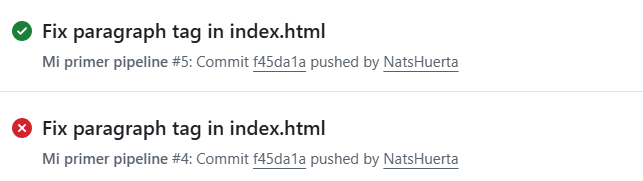

# mi-primer-pipeline

Proyecto de práctica para la creación de un pipeline automatizado usando GitHub Actions.

## Descripción

Este repositorio fue desarrollado como parte de una práctica para comprender el funcionamiento de los pipelines automatizados dentro de GitHub Actions.

El pipeline se encuentra configurado para ejecutarse automáticamente cada vez que se realiza un cambio en el repositorio mediante un push. Durante la ejecución, el sistema revisa el código del proyecto y verifica que cumpla correctamente con las reglas básicas de escritura utilizando un linter.

Además, se realizó una prueba de fallo intencional agregando un error de sintaxis al archivo del proyecto para observar cómo el pipeline detecta el problema y cambia su estado a rojo. Posteriormente, el error fue corregido para comprobar que el proceso volviera a ejecutarse correctamente y mostrara un estado verde.

## Evidencia

## Objetivo

Aprender el uso básico de GitHub Actions y comprender cómo la automatización ayuda a detectar errores de manera rápida dentro del desarrollo de software.
